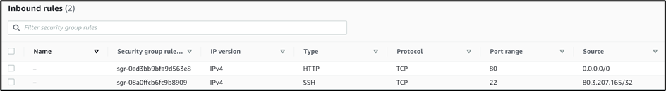
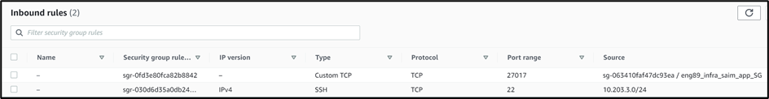
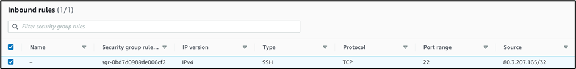

# VPC, Subnets, Networking, NACL

## Initial steps
- Create a VPC with the ip `10.103.0.0/24`. The 103 can be varied
- Create Subnets (Public, Private, Bastion) with different IPS for each subnet `10.103.CHANGE_THIS_NUMBER.0/24`. Use 1,2 and 3 for the three subnets
- Create an internet gateway 
- Create a route table and add route 0.0.0.0/0 and target internet gateway 
- Set the route table in the public and bastion subnets 

## Create security groups
- These security groups will be used when creating the instances
App

Database

Bastion

## Create separate NACL for subnets
- Assign the NACL to the corresponding subnets when complete
Public 

Private

Bastion

## Final steps
- Set the correct NACL for each of the subnets
- Create instances for app (public), DB (private) and bastion (public)
- Choose the appropriate subnets for each of them and the correct security groups 
- Once running, copy the eng89_devops.pem key into the bastion server using the command `scp -i eng89_devops.pem eng89_devops.pem ubuntu@BASTION_IP:~/` 
- SSH into the bastion server and check key has copied using `ls`. 
- Move the key into a ssh folder `mv eng89_devops.pem .ssh/` and run `chmod 400 eng89_devops.pem` in the folder. 
- SSH into the DB from this folder and you should be able to connect to the DB instance.
